- REACT is a JavaScript library created by Facebook.

- React creates a VIRTUAL DOM in memory.

- Instead of manipulating the browser's DOM directly, React creates a virtual DOM in memory, where it does all the necessary manipulating, before making the changes in the browser DOM.

- React only changes what needs to be changed!

- React finds out what changes have been made, and changes only what needs to be changed.

## React fiber

Fiber is the new reconciliation engine in React 16. Its main goal is to enable incremental rendering of the virtual DOM

## React Virtual DOM

What is the Virtual DOM?
The virtual DOM (VDOM) is a programming concept where an ideal, or “virtual”, representation of a UI is kept in memory and synced with the “real” DOM by a library such as ReactDOM. This process is called reconciliation.

## running typescript

TypeScript provides a command-line utility tsc that compiles (transpiles) TypeScript files (.ts) into JavaScript. However, the tsc compiler (short for TypeScript compiler) needs a JSON configuration file to look for TypeScript files in the project and generate valid output files at a correct location.

##

In Node.js, package.json is a versioning file used to install multiple packages in your project. As you initialize your node application, you will see three files installed in your app that is node_modules, package.json, and package.lock.json.

- package.lock.json is created for locking the dependency with the installed version.
- Without package.lock.json, there might be some differences in installed versions in different environments.
- It allows future devlopers to install the same dependencies in the project.
- Example

                    `package.json`
                    "dependencies": {
                        "dependency1": "^1.4.0",
                        "dependency2": "^1.5.2"
                    }

                    `package-lock.json`
                    "dependencies": {
                    "dependency1": {
                        "version": "1.4.0",
                        "resolved":"https://registry.npmjs.org/dependency1/-/dependency1-1.4.0.tgz",
                        "integrity":"sha512-a+UqTh4kgZg/SlGvfbzDHpgRu7AAQOmmqRHJnxhRZICKFUT91brVhNNt58CMWU9PsBbv3PDCZUHbVxuDiH2mtA=="
                    }
                    }

## React uses ES6, and you should be familiar with some of the new features like:

    - Classes
    - Arrow Functions
    - Variables (let, const, var)
    - Array Methods like .map()
    - Destructuring
    - Modules
    - Ternary Operator
    - Spread Operator

## RULES for react:

- react app name cannont be uppercase .`name can no longer contain capital letters`
- components should be in components folder under src folder
- component name should be PascalCase //PascalCase , first letter capital
- if multiple statements after return enclose them in ()

## BOOTSTRAP WITH React

https://getbootstrap.com/docs/5.3/components/list-group/

- npm i bootstrap
- import in App.js `import 'bootstrap/dist/css/bootstrap.css'`

## className

class is a reserved keyword in js and ts so we use `className` in React

## JSX

- In JSX we dont have forloop , but for a list of item we can use map
  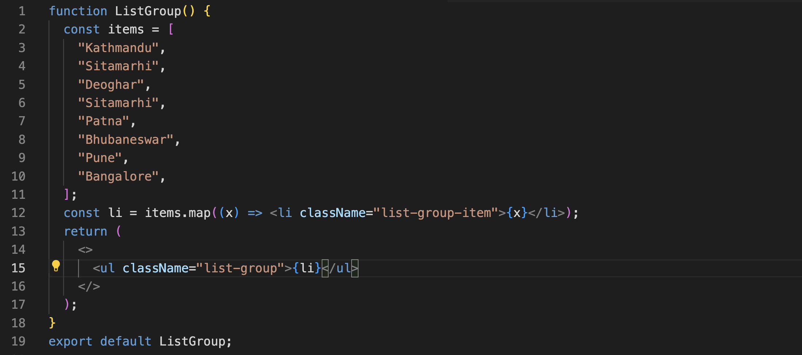
  here if we inspect we can see an error
  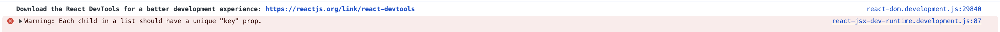
- Each list item should have a key property that uniquely identifies that item, react need this to keep track of our items so that when we add or remove items dynamically react knows what part of the page should be updated , so when rendering a list of items using the map method we should give each item a unique key

- In react component can not return more than one element , as the JSX element gets compiled to js as "React.createElement("h1")"

  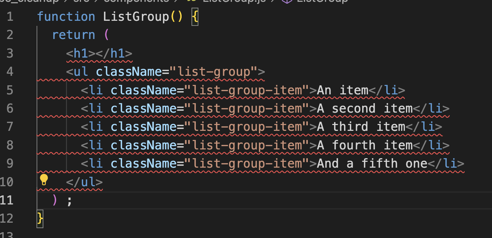

## FRAGMENTS

To solve this problem :

- wrap everything under div tag
- import frgament from react and wrap everything under <Fragment></Fragment> tags
  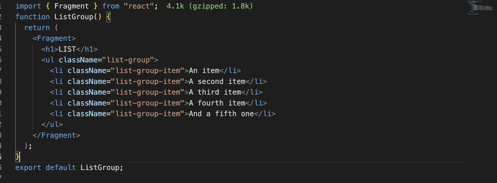
- empty angular brackets
  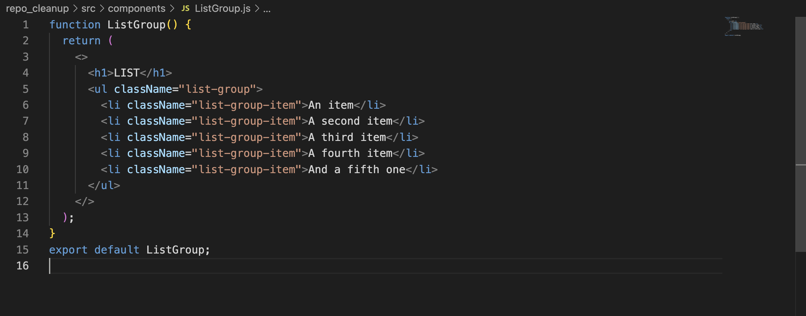

## if else in React

       if (items.length === 0) {
          return <h1> No Items Found</h1>;
        }

        return (
          <>
            <ul className="list-group">{li}</ul>
          </>
        );

## Event handling in React

- To click on a list item and see what item in console.
- while mapping items we can optionally add second item as index (which gives index of the item)
  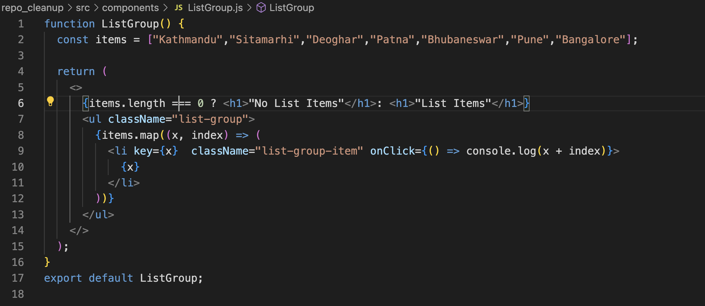
- The arrow function triggered on click event can have a parameter that represents the browser event
  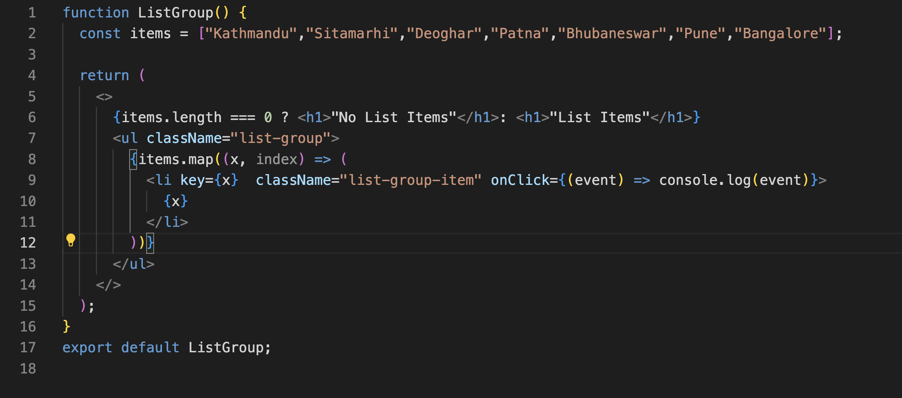
- When we check the console type of this object is `SyntheticBaseEvent`, This is built in class in react, because different browsers have different implementation of even objects , so to make this cross browser react team has created a class called synthetic base event that is a wrapper around the native browser event object . the properties of SyntheticBaseEvent are pretty same as the one of events
  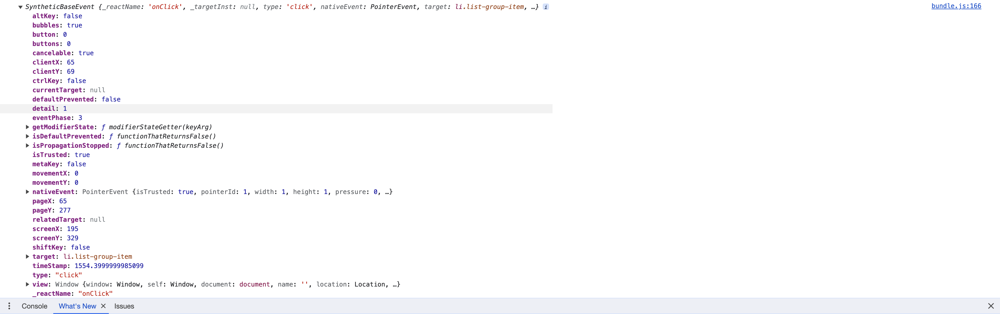
- If we have more complex logic on click we can write a method and call it here

## Type Annotation

Type annotation can only be used in type script file . it helps to define type of parameter and we can use the properties associated
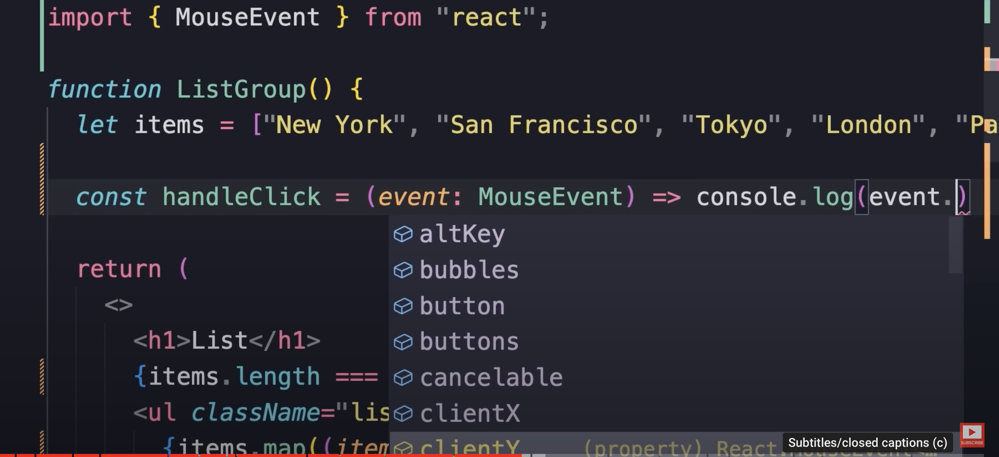

## useState

Use case: we want to highlight the selected item in a list

- There is a bootstrap class called active
- In cases where you don't need the component to update you can use variables instead of state.
  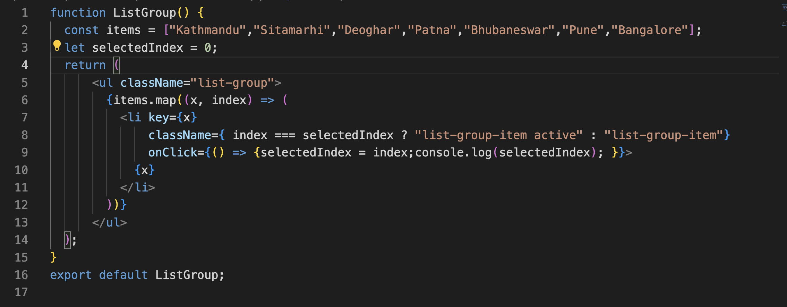
- In the above case the seleted index variable changes with the click still the `active` class is not applied
- the let variable is local to this function component , react is not aware of it. To solve this problem we will have to tell reat that this component has data or state that might change over time. and to do that we use built in function in react `useState` (Hook: to tap into built in features of react)

- use state return two things on destructuring the array returned
  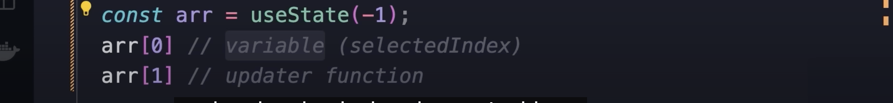
- Ex
  `const [name, setName] = useState("")`
  We can provide initial value of ""

- using the updater function we can update the state and at that point react will be notified that state of our component is changed and re-render the component

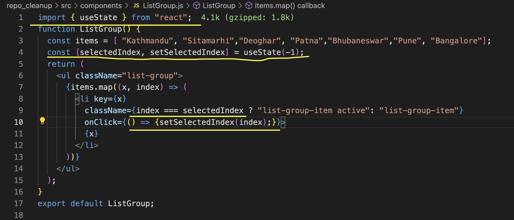

## Managing State

`Each Component has its own state`
lets say we add <ListGroup/> twice in the App.js

                 function App() {
                  return (
                    

                      <ListGroup /> <ListGroup />
                    

                  );
                 }

both have different states. As in if we click Bangalore in one other wont't be highlighted

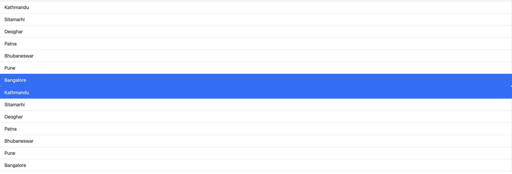

## PROPS

**Create Different Component for each list**
**lets say we have to create different component for different list (Ex- City list, VideoGame List)**

here comes props into the picture

PROPS are input to our components

- Passing props in the in the component
  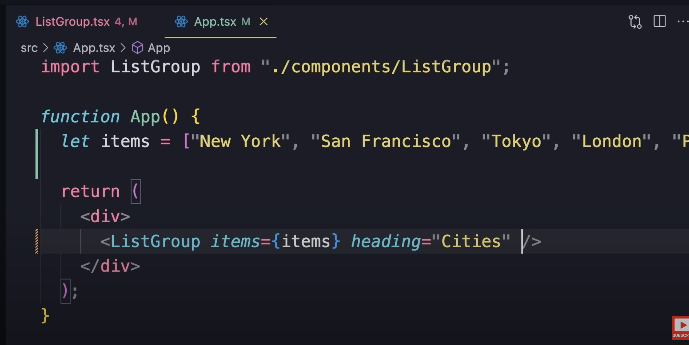

- here is were we can make use of interface , which can only be used in a typescript file

          interface Props {
          name: string[];
          heading: string;
          }

  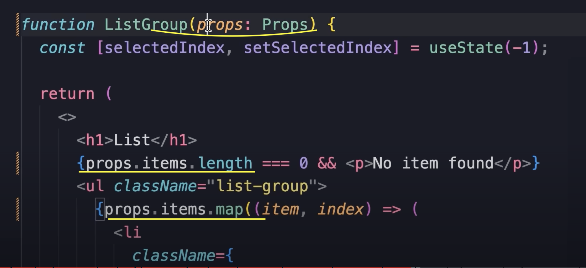

- better way to have cleaner code is
  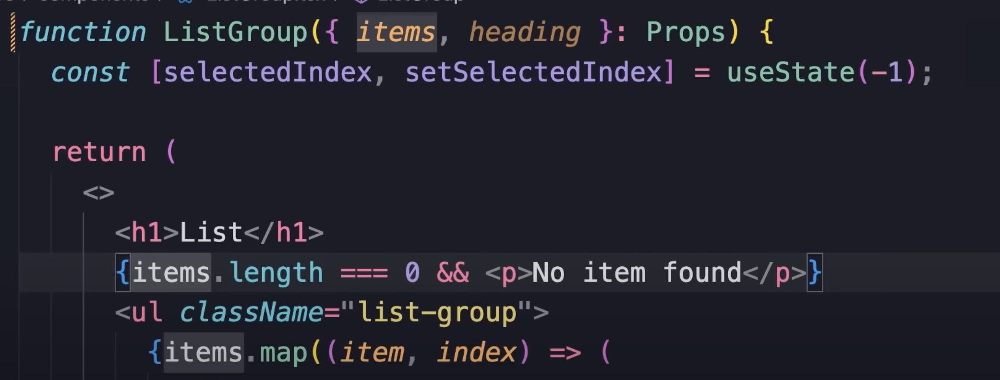

- Passing function as props
  Example
  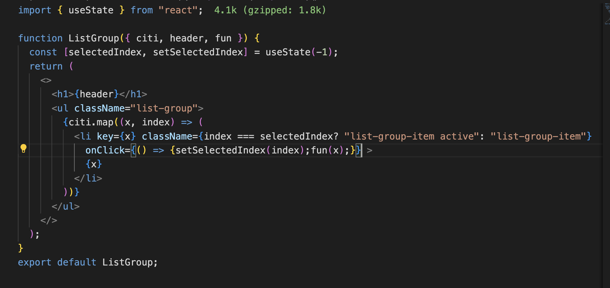
  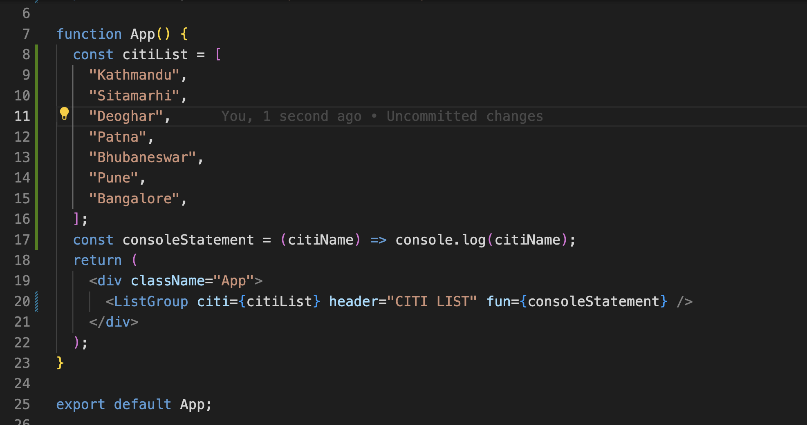

### PROPS VS STATE

| PROPS                                                                | STATE                                         |
| -------------------------------------------------------------------- | --------------------------------------------- |
| Props or properties are inputs or data passed to a component         | State is internal data managed by a component |
| Similar to function arguments                                        | Similar to local variables                    |
| Treat them as immutable(readonly), we should not try to change props | mutable , whole purpose of state              |

- `Note One thing common between props and state is anytime they change react will re-renderour component and update the DOM accordingly`

##Passing props as children

- The below mentioned example is fine but lets say we have multiple html text that can be issue in such case
  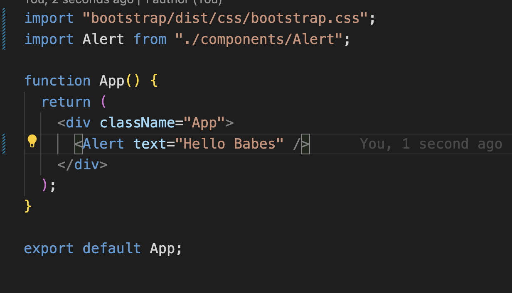
  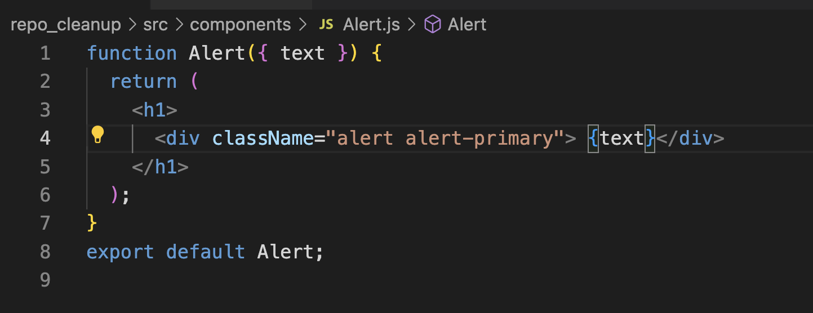
- to solve this we can use `children` as prop, this is a special prop that all component supports. We need to specifically use `children` keyword . we cannot use anyother keyword
  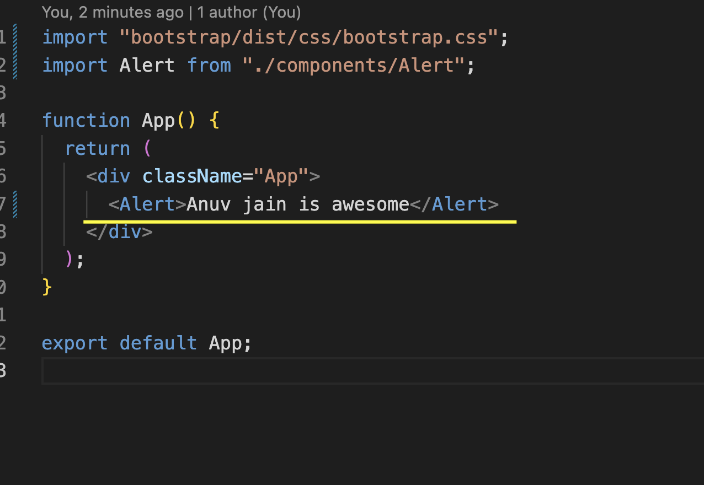
  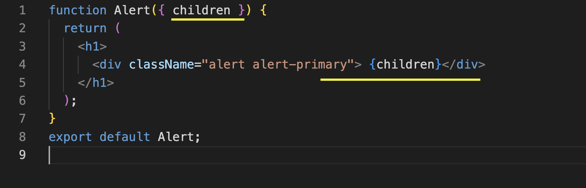

- In case we user interface to define the prop type and we are passing children like this :

                <Alert>
                Anuv jain is awesome
                </Alert>

- we cannot receive it as string, we need to use type `ReactNode`

            interface Props{
              children : ReactNode
            }

## optional property in interface

lets say we have some optional property in interface

         interface Property{
          header: string,
          cities: string[],
          pincode ?: string
         }

# ReactDeveloperTool

is available for chrome, firefox and microsoft edge https://chromewebstore.google.com/detail/react-developer-tools/fmkadmapgofadopljbjfkapdkoienihi

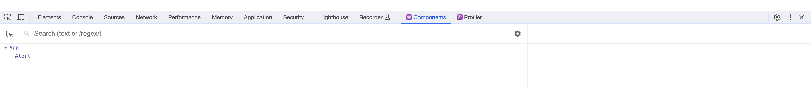

The components tab provide us details about our components. we can use it to inspect specific component , code
